# AI4Voice-core Architecture Diagram

## Infrastructure & Application Architecture

```mermaid
graph TB
    %% Internet and Users
    Internet["🌐 Internet Users"]
    
    %% AWS Region
    subgraph AWS["🏢 AWS Region: ap-south-1 (Mumbai)"]
        
        %% VPC
        subgraph VPC["🔒 VPC: AI4Voice-core_vpc (30.0.0.0/16)"]
            
            %% Public Subnets
            subgraph PublicSubnets["🌐 Public Subnets"]
                subgraph PublicAZ1["📍 Public AZ-1a (30.0.8.0/22)"]
                    IGW1["🌍 Internet Gateway"]
                    NAT1["🔀 NAT Gateway"]
                    ALB1["⚖️ ALB - Dhruva"]
                    Bastion1["🖥️ Bastion Host"]
                end
                
                subgraph PublicAZ2["📍 Public AZ-1b (30.0.12.0/22)"]
                    IGW2["🌍 Internet Gateway"]
                    NAT2["🔀 NAT Gateway"]
                    ALB2["⚖️ ALB - AI Models"]
                    Bastion2["🖥️ Bastion Host"]
                end
            end
            
            %% Private Subnets
            subgraph PrivateSubnets["🔐 Private Subnets"]
                subgraph PrivateAZ1["📍 Private AZ-1a (30.0.0.0/22)"]
                    EKSControl1["☸️ EKS Control Plane"]
                    EKSNode1["🖥️ EKS Worker Node (t3a.large)"]
                    
                    subgraph Pods1["📦 Application Pods"]
                        AI1["🤖 AI Model Pod 1"]
                        AI2["🤖 AI Model Pod 2"]
                        Dhruva1["🎵 Dhruva App Pod 1"]
                    end
                end
                
                subgraph PrivateAZ2["📍 Private AZ-1b (30.0.4.0/22)"]
                    EKSControl2["☸️ EKS Control Plane"]
                    EKSNode2["🖥️ EKS Worker Node (t3a.large)"]
                    
                    subgraph Pods2["📦 Application Pods"]
                        AI3["🤖 AI Model Pod 3"]
                        Dhruva2["🎵 Dhruva App Pod 2"]
                    end
                end
            end
            
            %% EKS Cluster
            subgraph EKSCluster["☸️ EKS Cluster: AI4Voice-core"]
                EKSControl1
                EKSControl2
                EKSNode1
                EKSNode2
            end
            
            %% Services
            subgraph Services["🔧 Kubernetes Services"]
                AIService["🤖 AI Model Service"]
                DhruvaService["🎵 Dhruva Service"]
            end
            
            %% Ingress
            subgraph Ingress["🌐 Ingress Controllers"]
                AIngress["🤖 AI Models Ingress"]
                DIngress["🎵 Dhruva Ingress"]
            end
        end
    end
    
    %% External Services
    subgraph External["🌍 External Services"]
        ECR["📦 Amazon ECR"]
        CloudWatch["📊 CloudWatch"]
        Route53["🌐 Route 53"]
    end
    
    %% Traffic Flow
    Internet --> ALB1
    Internet --> ALB2
    ALB1 --> AIngress
    ALB2 --> DIngress
    AIngress --> AIService
    DIngress --> DhruvaService
    AIService --> AI1
    AIService --> AI2
    AIService --> AI3
    DhruvaService --> Dhruva1
    DhruvaService --> Dhruva2
    
    %% Management Access
    Bastion1 --> EKSControl1
    Bastion2 --> EKSControl2
    
    %% External Access
    EKSNode1 --> ECR
    EKSNode2 --> ECR
    EKSControl1 --> CloudWatch
    EKSControl2 --> CloudWatch
    
    %% DNS
    Route53 --> ALB1
    Route53 --> ALB2
    
    %% Styling
    classDef publicSubnet fill:#e1f5fe,stroke:#01579b,stroke-width:2px
    classDef privateSubnet fill:#f3e5f5,stroke:#4a148c,stroke-width:2px
    classDef eksCluster fill:#e8f5e8,stroke:#1b5e20,stroke-width:3px
    classDef application fill:#fff3e0,stroke:#e65100,stroke-width:2px
    classDef external fill:#fce4ec,stroke:#880e4f,stroke-width:2px
    
    class PublicSubnets,PublicAZ1,PublicAZ2,IGW1,IGW2,NAT1,NAT2,ALB1,ALB2,Bastion1,Bastion2 publicSubnet
    class PrivateSubnets,PrivateAZ1,PrivateAZ2,EKSControl1,EKSControl2,EKSNode1,EKSNode2 privateSubnet
    class EKSCluster,Services,Ingress eksCluster
    class Pods1,Pods2,AI1,AI2,AI3,Dhruva1,Dhruva2,AIService,DhruvaService,AIngress,DIngress application
    class External,ECR,CloudWatch,Route53 external
```

## Network Flow Diagram

```mermaid
sequenceDiagram
    participant User as 👤 End User
    participant ALB as ⚖️ Application Load Balancer
    participant Ingress as 🌐 Ingress Controller
    participant Service as 🔧 Kubernetes Service
    participant Pod as 📦 Application Pod
    participant EKS as ☸️ EKS Cluster
    
    User->>ALB: HTTP/HTTPS Request
    ALB->>Ingress: Route to Ingress
    Ingress->>Service: Forward to Service
    Service->>Pod: Load Balance to Pod
    Pod->>EKS: Process Request
    EKS->>Pod: Return Response
    Pod->>Service: Send Response
    Service->>Ingress: Forward Response
    Ingress->>ALB: Return to ALB
    ALB->>User: HTTP/HTTPS Response
```

## Security Architecture

```mermaid
graph LR
    subgraph Security["🔒 Security Layers"]
        subgraph Network["🌐 Network Security"]
            SG1[🛡️ Security Groups]
            NACL[🚧 Network ACLs]
            IGW[🌍 Internet Gateway]
            NAT[🔀 NAT Gateway]
        end
        
        subgraph Access["🔑 Access Control"]
            IAM[👤 IAM Roles]
            RBAC[🎭 Kubernetes RBAC]
            Bastion[🖥️ Bastion Host]
        end
        
        subgraph Data["💾 Data Security"]
            Encryption[🔐 Encryption at Rest]
            Transit[🔒 Encryption in Transit]
            Secrets[🗝️ Kubernetes Secrets]
        end
    end
    
    subgraph Monitoring["📊 Monitoring & Logging"]
        CloudWatch[📊 CloudWatch]
        Prometheus[📈 Prometheus]
        Grafana[📊 Grafana]
    end
    
    Security --> Monitoring
```

## Application Deployment Architecture

```mermaid
graph TB
    subgraph Apps["🚀 Application Deployment"]
        subgraph AI["🤖 AI Models"]
            AIModel1[🧠 Model 1]
            AIModel2[🧠 Model 2]
            AIModel3[🧠 Model 3]
            AIService[🔧 AI Service]
        end
        
        subgraph Dhruva["🎵 Dhruva Application"]
            DhruvaApp1[🎵 App Instance 1]
            DhruvaApp2[🎵 App Instance 2]
            DhruvaService[🔧 Dhruva Service]
        end
        
        subgraph Storage["💾 Storage"]
            EBS[💿 EBS Volumes]
            EFS[📁 EFS File System]
        end
        
        subgraph Config["⚙️ Configuration"]
            ConfigMaps[📋 ConfigMaps]
            Secrets[🗝️ Secrets]
        end
    end
    
    AIModel1 --> AIService
    AIModel2 --> AIService
    AIModel3 --> AIService
    DhruvaApp1 --> DhruvaService
    DhruvaApp2 --> DhruvaService
    
    AIService --> Storage
    DhruvaService --> Storage
    AIModel1 --> Config
    DhruvaApp1 --> Config
```

## Resource Allocation

| Component | CPU | Memory | Storage | Replicas | Purpose |
|-----------|-----|--------|---------|----------|---------|
| AI Models | 1000m | 4Gi | 100GB | 3 | Model Inference |
| Dhruva App | 500m | 2Gi | 100GB | 2 | Application Logic |
| EKS Nodes | 2000m | 8Gi | 100GB | 2 | Worker Nodes |
| ALB | - | - | - | 2 | Load Balancing |

## Endpoints

- **AI Models**: `https://ai-models.ai4voice.com`
- **Dhruva App**: `https://dhruva.ai4voice.com`
- **EKS API**: Private endpoint (via bastion host)
- **Monitoring**: `https://monitoring.ai4voice.com`
