# AI4Voice-core Architecture Diagram

## Infrastructure & Application Architecture

## Network Flow Diagram

```mermaid
sequenceDiagram
    participant User as 👤 End User
    participant ALB as ⚖️ Load Balancer
    participant Ingress as 🌐 Ingress
    participant Service as 🔧 Service
    participant Pod as 📦 App Pod
    
    User->>ALB: 1. HTTP Request
    ALB->>Ingress: 2. Route Request
    Ingress->>Service: 3. Forward to Service
    Service->>Pod: 4. Load Balance to Pod
    Pod->>Service: 5. Process & Respond
    Service->>Ingress: 6. Return Response
    Ingress->>ALB: 7. Forward Response
    ALB->>User: 8. HTTP Response
```

## Security Architecture

```mermaid
graph TB
    subgraph Security["🔒 Security Layers"]
        Network["🌐 Network Security<br/>• Security Groups<br/>• Private Subnets<br/>• NAT Gateway"]
        Access["🔑 Access Control<br/>• IAM Roles<br/>• Bastion Host<br/>• Private EKS"]
        Data["💾 Data Security<br/>• Encryption at Rest<br/>• Encryption in Transit<br/>• Kubernetes Secrets"]
    end
    
    subgraph Monitoring["📊 Monitoring"]
        CloudWatch["📊 CloudWatch<br/>Logs & Metrics"]
    end
    
    Security --> Monitoring
```

## Application Deployment Architecture

```mermaid
graph TB
    subgraph Apps["🚀 Applications"]
        AI["🤖 AI Models<br/>• 3 Pods<br/>• Model Inference<br/>• GPU/CPU Optimized"]
        Dhruva["🎵 Dhruva App<br/>• 2 Pods<br/>• Voice Processing<br/>• Web Interface"]
    end
    
    subgraph Infrastructure["🏗️ Infrastructure"]
        Storage["💾 Storage<br/>• EBS Volumes<br/>• 100GB per Node"]
        Config["⚙️ Configuration<br/>• ConfigMaps<br/>• Secrets"]
        Services["🔧 Services<br/>• Load Balancing<br/>• Service Discovery"]
    end
    
    AI --> Services
    Dhruva --> Services
    AI --> Storage
    Dhruva --> Storage
    AI --> Config
    Dhruva --> Config
```

## Resource Allocation

| Component | Instance Type | CPU | Memory | Storage | Replicas | Purpose |
|-----------|---------------|-----|--------|---------|----------|---------|
| **CPU Worker Nodes** | t3a.xlarge | 4 vCPU | 16Gi | 100GB | 1 | Dhruva App |
| **GPU Worker Nodes** | g4dn.xlarge | 4 vCPU | 16Gi | 100GB | 2 | AI Models |
| **AI Models** | - | 2000m | 8Gi | - | 3 | Model Inference |
| **Dhruva App** | - | 1000m | 4Gi | - | 2 | Application Logic |
| **EKS Control Plane** | - | - | - | - | 2 | Cluster Management |
| **ALB** | - | - | - | - | 1 | Load Balancing |
| **NAT Gateway** | - | - | - | - | 2 | Internet Access |
| **Bastion Host** | t3a.medium | 2 vCPU | 4Gi | 20GB | 2 | Management Access |

## Subnet Breakdown

### 🌐 **Public Subnets**
| Subnet | AZ | CIDR | Components | Purpose |
|--------|----|----- |------------|---------|
| **Public AZ-1a** | ap-south-1a | 30.0.8.0/22 | IGW, NAT Gateway, ALB, Bastion Host | Internet access, Load balancing |
| **Public AZ-1b** | ap-south-1b | 30.0.12.0/22 | NAT Gateway, Bastion Host | High availability, Management access |

### 🔐 **Private Subnets**
| Subnet | AZ | CIDR | Components | Purpose |
|--------|----|----- |------------|---------|
| **Private AZ-1a** | ap-south-1a | 30.0.0.0/22 | EKS Control Plane, CPU Worker (t3a.xlarge), GPU Worker (g4dn.xlarge) | Dhruva App, AI Models |
| **Private AZ-1b** | ap-south-1b | 30.0.4.0/22 | EKS Control Plane, GPU Worker (g4dn.xlarge) | AI Models, High availability |

### 🔀 **Network Components**
- **Internet Gateway**: Provides internet access to public subnets
- **NAT Gateway**: Allows private subnets to access internet for outbound traffic
- **Route Tables**: Direct traffic between subnets and gateways
- **Security Groups**: Control inbound/outbound traffic to resources

## Endpoints

- **AI Models**: `https://ai-models.ai4voice.com`
- **Dhruva App**: `https://dhruva.ai4voice.com`
- **EKS API**: Private endpoint (via bastion host)
- **Monitoring**: `https://monitoring.ai4voice.com`
